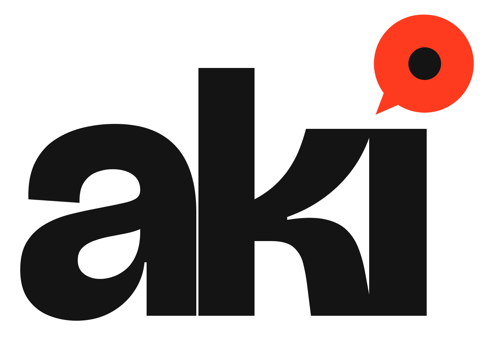
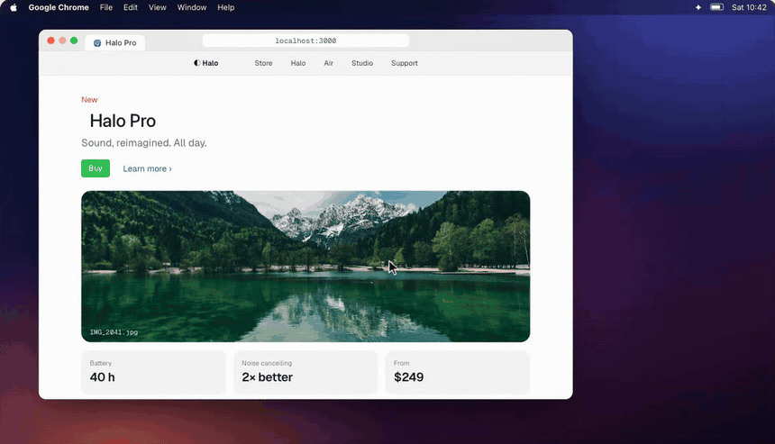
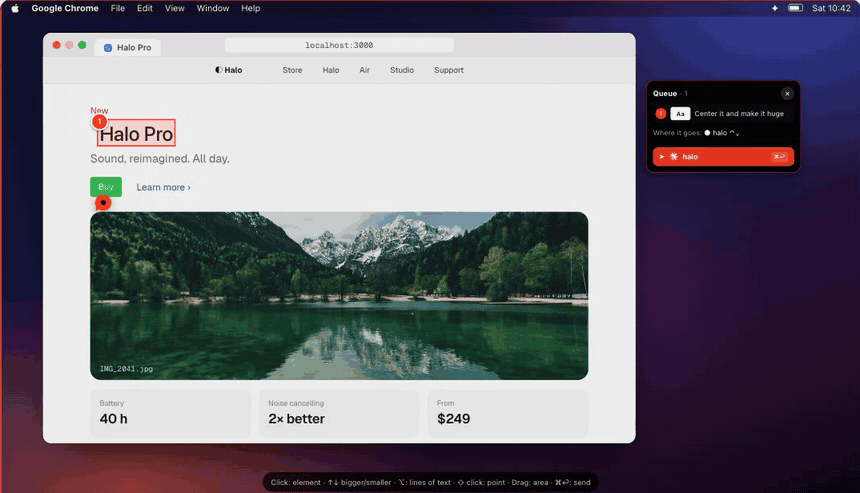
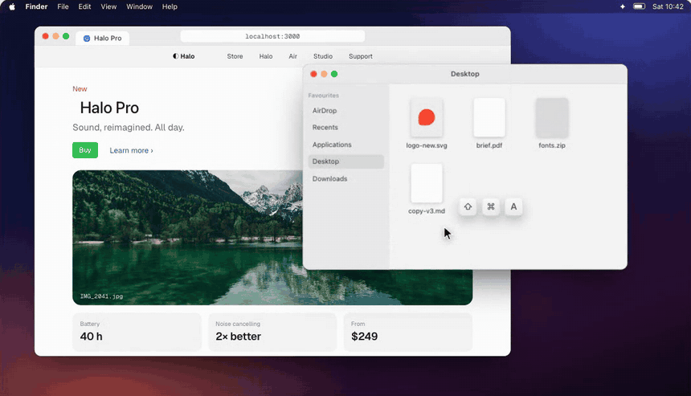
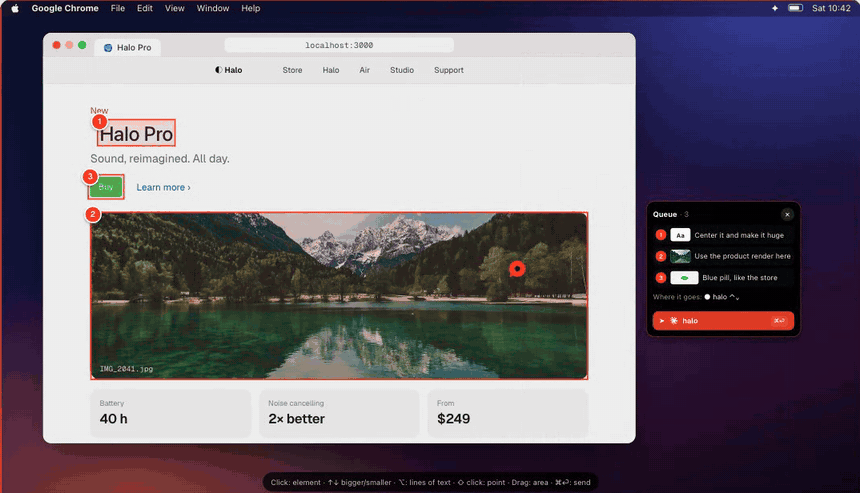
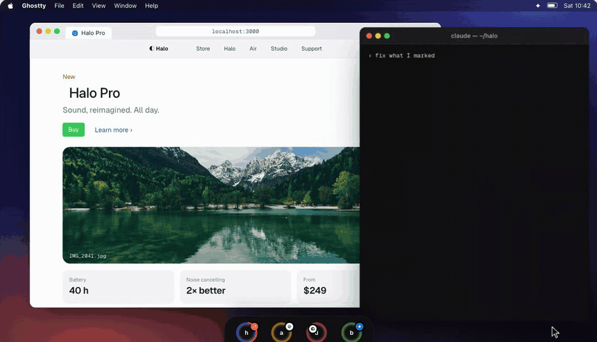
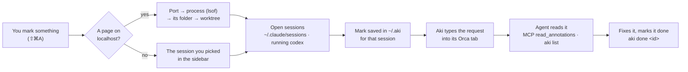

<p align="center">
  <a href="https://useaki.vercel.app">
    <picture>
      <source media="(prefers-color-scheme: dark)" srcset="brand/logos/aki-logotipo-claro.svg">
      
    </picture>
  </a>
</p>

<h3 align="center">Show your AI agent exactly what to fix.</h3>

<p align="center">
  Point at anything on your Mac — a button, a line in the terminal, a whole area — say what should change,<br>
  and Claude Code, Codex or your agent of choice gets it in the right session. No pasting screenshots, no ⌘Tab, no "not that one".
</p>

<p align="center">
  <a href="https://useaki.vercel.app"><b>Website</b></a> ·
  <a href="#install"><b>Download</b></a> ·
  <a href="#how-it-works"><b>How it works</b></a> ·
  <a href="#shortcuts"><b>Shortcuts</b></a> ·
  <a href="https://x.com/muprataviera"><b>X</b></a>
</p>

<p align="center">
  
  
  <a href="../../releases/latest"></a>
  
  <a href="https://x.com/muprataviera"></a>
</p>

<p align="center">
  <a href="https://useaki.vercel.app"></a>
</p>

---

## Why

Telling an agent *what* to change is the slow part: take a screenshot, paste it, describe where to look, switch to the right terminal, hope it finds the element. Aki turns that into **point, say it, send**. The agent receives the exact element (selector, text, HTML, even the React source file), your note, and a crop only when a picture actually helps — so it spends tokens on the fix, not on guessing.

## How it works

| | | |
|:-:|:-:|:-:|
| **1 · Point** | **2 · Say it** | **3 · Send** |
| <kbd>⇧⌘A</kbd>, then click an element, drag an area or hold <kbd>⌥</kbd> for lines of text. | Write what should change. Queue as many marks as you like; edit or drop any of them. | <kbd>⌘⏎</kbd>. Aki types the request into that session's terminal; the agent reads it over MCP and marks each one done. |

<table>
  <tr>
    <td width="50%"><br><b>Mark an area.</b> Drag over anything — a chart, a broken layout, a whole panel.</td>
    <td width="50%"><br><b>Any app.</b> Finder, Figma, Xcode, a terminal error. If it's on screen, it can be marked.</td>
  </tr>
  <tr>
    <td width="50%"><br><b>Queue &amp; send.</b> Marks wait in a queue; one send hands them all to the right session.</td>
    <td width="50%"><br><b>What your agent reads.</b> The page, the element, your note and a crop. It fixes each one and resolves it.</td>
  </tr>
</table>

<p align="center"><i>Want to try it without installing? The <a href="https://useaki.vercel.app">website</a> lets you mark the page itself.</i></p>

## Features

| | |
|---|---|
| 🎯 **Exact elements in Chrome, no extension** | Aki asks the page what's under the pointer: the element, a unique CSS selector, its text and HTML, the React component's source in dev builds. Works in Chrome, Brave, Edge, Arc and Vivaldi. |
| ⌨️ **Walk the page like DevTools** | <kbd>↑</kbd> the container, <kbd>↓</kbd> inside, <kbd>←</kbd> <kbd>→</kbd> the neighbours — even a CSS `::after` arrow. |
| 🖥️ **Any app** | Elsewhere it uses macOS Accessibility: buttons, rows, tabs, the browser's own bar, floating panels. Areas and points work everywhere. |
| 📝 **Text first, pictures when they help** | Each mark carries the text it covers; a small crop goes along only when what you marked is visual. You can switch either on or off. |
| 🧭 **The right terminal, by itself** | A page on `localhost:3000` belongs to a worktree; Aki finds the session running it. Otherwise it goes to the session you picked. |
| ⏱️ **Your agent wakes up** | Seconds after you stop, Aki types the request into the session's tab — and never glues it to something you were typing there. |
| 🟠 **One ring per session** | A sidebar on the screen edge shows every Claude Code / Codex session, grouped by project, with its state, context used, your 5-hour and weekly limits, and what's waiting. |
| 📬 **Sent, then done** | A countdown on the session's ring until the request goes in; a ✓ when the agent has resolved every mark. |
| 🕘 **History** | <kbd>⇧⌘H</kbd> lists every mark with its size; move marks between sessions; done marks clean themselves up. |
| ⚙️ **Yours to set** | Light or dark, Aki's red or your Mac's accent, four sizes, shortcuts you choose, nine languages (English, Português, Español, Français, Deutsch, 日本語, 中文, 한국어, Italiano). |
| 🔄 **Updates by itself** | Signed updates with an optional beta channel. |

## Works with

**Agents:** Claude Code · Codex · Gemini CLI · Grok CLI · opencode · Cursor Agent — anything that can run a command or speak MCP.<br>
**Terminals:** Orca (Aki types straight into the session's tab), plus any terminal for reading marks.<br>
**Launchers:** Raycast, Alfred, Shortcuts and Spotlight through `aki://` links.

## Install

**One line** (about a minute — downloads the latest version, puts it in Applications and opens it):

```sh
curl -fsSL https://aki-updates.vercel.app/aki-install.sh | sh
```

Or by hand:

1. Download the latest **`Aki-x.y.z.dmg`** from [Releases](../../releases) (or the [website](https://useaki.vercel.app)) and drag **Aki** to Applications.
2. First launch only: macOS asks to confirm an app from the internet — **System Settings → Privacy & Security → Open Anyway**. (The one-line install skips this.) Updates install without asking again.
3. Aki opens **Get started**: each permission below, why it's needed, and a button that takes you straight there. Each turns green when it's given.

Apple Silicon, macOS 14 or later.

### Permissions, and why

| To… | Aki needs | Why |
|---|---|---|
| See what you mark (crop it, read its text) | **Screen Recording** | macOS asks this of any app that looks at the screen. Nothing is recorded; marks stay on your Mac until you send them to your agent. |
| Point at buttons, rows and tabs in any app | **Accessibility** | It's how Mac apps describe their buttons and lists to other apps. |
| Hand your marks to Claude Code or Codex | **Aki's MCP server** in the agent (Settings → Agents → *Connect*) | It's how agents get new tools. Sessions already open see it after a restart. |
| Pick the exact element on a web page | In the browser: **View → Developer → Allow JavaScript from Apple Events**, then allow Aki to control it | Aki asks the page itself which element is under the pointer — no extension. |

### Anonymous notices (telemetry)

Aki sends no usage data and no crash reports. The one exception is two small, anonymous notices, so the maker knows how many people use Aki and on which version (what to fix first, when an old version can be retired):

| When | What is sent |
|---|---|
| Aki is installed (about two minutes after the first launch) | Aki's version, macOS version, chip, preferred language |
| Aki updates to a new version | the same, plus the version it updated from |

The download host (`aki-updates.vercel.app`, on Vercel) adds the approximate state or region and country (never the city). **No account, no identifier, no IP address kept, nothing you mark or type.** They're on by default and explained in **Get started**; turn them off there or in **Settings → General → Privacy** — when off, nothing is sent. The code is short and readable: [`Sources/Aki/App/InstallPing.swift`](Sources/Aki/App/InstallPing.swift). Details in the [privacy notice](https://useaki.vercel.app/privacy).

### Where Aki lives

Aki is always on: the **bar at the edge of your screen** and the **pin in the menu bar** (mark, history, sidebar, settings). It stays out of the Dock and ⌘Tab, and shows there while Settings or History is open. Search "Aki" in Spotlight to open Settings; want it in the Dock? **Settings → General → App icon**.

## Shortcuts

| Keys | |
|---|---|
| <kbd>⇧⌘A</kbd> | Mark the screen |
| <kbd>⇧⌘H</kbd> | History |
| <kbd>⏎</kbd> | Add the mark to the queue |
| <kbd>⌘⏎</kbd> | Send (with a queue: the whole queue — the card also offers *Only this one*) |
| <kbd>⇥</kbd> | Next session |
| <kbd>↑</kbd> <kbd>↓</kbd> <kbd>←</kbd> <kbd>→</kbd> | Walk the page's elements |
| <kbd>⌥</kbd> | Lines of text instead of elements |
| <kbd>esc</kbd> | Leave (the queue is kept) |

Both global shortcuts can be changed in **Settings → Shortcuts**.

### Raycast, Alfred, Spotlight

Aki answers four links: `aki://mark`, `aki://history`, `aki://settings`, `aki://sidebar`.

- **Raycast:** Settings → Shortcuts → *Add to Raycast* writes four script commands to `~/.aki/raycast`; add that folder once in Raycast (Extensions → + → Add Script Directory). Each command can get its own hotkey. The same scripts live in [`integrations/raycast`](integrations/raycast).
- **Alfred** or any launcher: open the link.
- **Spotlight:** make a Shortcut that opens `aki://mark`; it shows up in Spotlight by its name.

## How Aki finds the right session



Sessions come from Claude Code's own registry (`~/.claude/sessions`) and from the agent processes running on your Mac, matched to a worktree by their folder. Each ring in the sidebar is one of them.

## What your agent reads

Through the MCP tools (`read_annotations`, `wait_for_annotations`, `get_annotation_image`, `resolve_annotation`) or the `aki` command:

```sh
aki list        # marks for this folder / session
aki wait        # wait until new marks arrive
aki done <id>   # mark one as done
aki terminals   # agent sessions Aki sees
```

```text
## aki_1791130541219_0a9c912d  (2026-10-04 16:15)
page:     http://localhost:3000/
app:      Google Chrome — Halo Pro
comment:  Center it and make it huge
kind:     element
element:  <h1> section.hero > h1.hero-title
text:     Halo Pro
file:     src/components/Hero.tsx:42
```

## Privacy

Everything you mark stays on your Mac, in `~/.aki`. Aki's local server listens on `127.0.0.1` only and checks every request's origin. Nothing is sent anywhere except the update check and the optional, anonymous notices described in [Anonymous notices](#anonymous-notices-telemetry).

## Build from source

Needs the Xcode Command Line Tools (Swift 6) — no Xcode project.

```sh
scripts/dev-cert.sh   # once: a local signing identity, so macOS keeps permissions across builds
scripts/install.sh    # build, sign, put in /Applications and open
swift run AkiChecks   # checks
python3 scripts/check-translations.py   # every language complete, no repeated text
```

How it's built: [docs/ARCHITECTURE.md](docs/ARCHITECTURE.md) · how to help: [CONTRIBUTING.md](CONTRIBUTING.md) · what changed: [CHANGELOG.md](CHANGELOG.md) · security reports: [SECURITY.md](SECURITY.md).

<details>
<summary><b>FAQ</b></summary>

**Does it need a browser extension?** No. Chrome-based browsers answer through Apple Events (turn on *View → Developer → Allow JavaScript from Apple Events* once).

**Does it send screenshots to my agent?** Only when you mark something visual, and you can switch it off per mark. Text is the default: cheaper and more precise.

**Which terminal do I need?** Any, to read marks. Aki types the request into the session by itself in Orca; elsewhere the agent picks marks up with `aki wait` or when you ask.

**Intel Macs?** Not yet.

</details>

## Credits

Aki builds on ideas and code from [Codenotch](https://github.com/vinzdg/codenotch), [Vibe Annotations](https://github.com/RaphaelRegnier/vibe-annotations) (MIT version), [Annotate](https://github.com/epilande/Annotate), [react-grab](https://github.com/aidenybai/react-grab) and [@medv/finder](https://github.com/antonmedv/finder), and updates with [Sparkle](https://sparkle-project.org). Their notices are in [THIRD_PARTY_NOTICES](THIRD_PARTY_NOTICES).

## License

[Functional Source License 1.1](LICENSE) (FSL-1.1-ALv2) © 2026 Murilo Prataviera. Use it, read it, change it and send improvements — anything except building a product that competes with Aki. Each version becomes Apache-2.0 two years after its release. Made by [Murilo Prataviera](https://github.com/muriloprataviera) · [X](https://x.com/muprataviera) · [Instagram](https://www.instagram.com/muriloprataviera).
