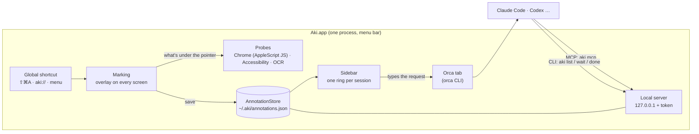

# How Aki is built

A map for anyone (person or agent) about to change Aki. It says where things live and how a mark travels; the code says the rest.

## The big picture



1. **⇧⌘A** (or `aki://mark`, the menu, a ring) opens **marking**: a transparent overlay per screen over a capture of it.
2. While you point, **probes** find what's there: on Chrome-family browsers Aki asks the page itself (an AppleScript `execute javascript` on a dedicated thread); elsewhere macOS Accessibility; text is read from the capture (Vision OCR).
3. **Send** saves each mark to the **store** (JSON on disk, cross-process lock), with the session it's for, the text, an optional crop in `~/.aki/images`.
4. The **sidebar** model sees the new marks, waits for you to stop and for the agent to be free, then **types the request** into that session's Orca tab.
5. The **agent** reads the marks through the **MCP server** or the **`aki` CLI** (both talk to the local server), fixes them and marks each one done.

## Targets (`Package.swift`)

| Target | What | Depends on |
|---|---|---|
| `AkiCore` | Everything without UI: the store, the local HTTP server and API, the client the CLI and MCP use, finding agent sessions. Testable. | — |
| `Aki` | The app *and* the `aki` command (same binary: `main.swift` picks by its arguments). | `AkiCore`, Sparkle |
| `AkiChecks` | The checks, as an executable (`swift run AkiChecks`) — no Xcode needed. | `AkiCore` |

## Where things live

```
Sources/
  AkiCore/
    AkiHome.swift          ~/.aki: paths, the token
    Model/                 Annotation (a mark), JSONValue
    Store/                 AnnotationStore (marks on disk, locked), DiskUsage (cleanup)
    Server/                HTTPServer (127.0.0.1), HTTP parsing, AkiAPI (routes, token, Host/Origin checks)
    Client/                AkiClient (CLI/MCP → server), Waiter (aki wait), AnnotationText (what the agent reads)
    Sessions/              AgentSessions (claude/codex processes → sessions), ClaudeSessions, ClaudeStatus, Worktree
  Aki/
    main.swift             entry: the app, or the aki command (list, wait, done, mcp, serve…)
    App/                   AppDelegate, menu bar, Updates (Sparkle), TerminalJump (Orca), TerminalApps, AkiBrand
    Marking/               MarkingController (lifecycle), MarkingSession (state, save), MarkingView (overlay UI),
                           BrowserProbe (Chrome JS), ElementProbe (Accessibility), ScreenGrab, ScreenText (OCR),
                           HotKey (Carbon), AkiCursor
    Sidebar/               SidebarController (panel, hit-testing), SidebarModel (sessions, delivery), SidebarViews,
                           SidebarLayout, EdgeShape, AgentGlyph (AI logos, session identity)
    History/               HistoryWindow (search, filters by AI / app / project / session)
    Settings/              Preferences, SettingsWindow, GetStarted (permissions), Shortcuts (recorder, Raycast)
    Localization/          L10n (engine) + one table per language
    MCP/                   MCPServer (stdio JSON-RPC for agents)
    Codenotch/             views adapted from Codenotch (MIT): the bar's shape, motion, settings controls
Tests/AkiChecks/           store, API, auth, waiting, session detection
Resources/                 Info.plist, app icon, logotype
scripts/                   install, bundle/sign, release → publish, DMG, icon, one-line installer, checks
integrations/raycast/      Raycast script commands
brand/                     logos, tokens, fonts
```

## Decisions worth knowing

- **One binary, no Xcode.** SwiftPM only; `scripts/bundle.sh` assembles and signs `Aki.app`. The `Aki` target runs in Swift 5 language mode (the Codenotch views were written for it).
- **Same certificate always** ("Aki Dev"): macOS keeps Screen Recording and Accessibility across updates.
- **Texts in English in the code**, `L10n.t("…")`, one dictionary per language — a repeated key crashes the app, so `scripts/check-translations.py` guards it.
- **The store is a JSON file**, locked across processes; each write reads the file fresh under the lock.
- **Delivery goes only to Orca tabs** (by the tab handle Orca puts in the process environment); in other terminals the agent picks marks up itself (`aki wait` / MCP).
- **Security**: see [SECURITY.md](../SECURITY.md).
